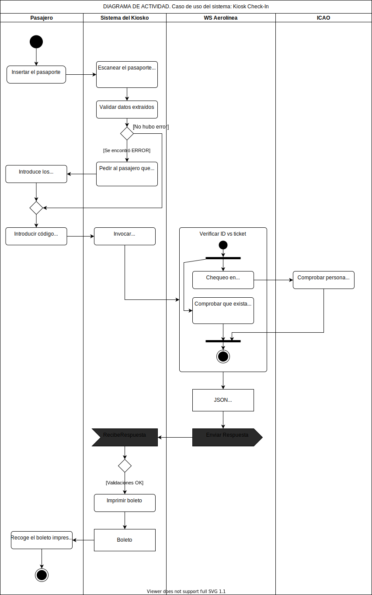

# UML Modeling

## Table of content

- [Business Use Case Model](#business-use-case-model)
- [Subsystem Use Case Model -> Kiosk Check-In](#subsystem-use-case-model---kiosk-check-in)
- [Activity Diagram -> Kiosk Check-In System Use Case](#activity-diagram---kiosk-check-in-system-use-case)

## Business Use Case Model

## Subsystem Use Case Model -> Kiosk Check-In

## Activity Diagram -> Kiosk Check-In System Use Case

